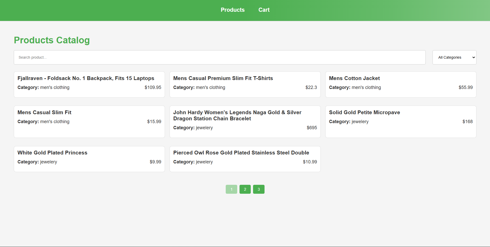

# React E-Commerce Frontend Application
A scalable and performance-oriented E-Commerce frontend application built with React, designed to demonstrate real-world frontend engineering practices commonly used in startup and global product teams.

This project emphasizes clean architecture, predictable state, and UI performance, rather than backend complexity.

## 🚀 Project Overview
The application simulates a typical product catalog experience found in modern e-commerce platforms, including product discovery, filtering, and pagination.

The focus of this project is to showcase how a frontend engineer:

- Structures a growing React codebase
- Manages UI state and derived data
- Prevents unnecessary re-renders
- Builds reusable and maintainable components

## 🌍 Live Demo
https://e-commerce-react-one-tau.vercel.app/

## Key Features
- Product listing with client-side pagination
- Search products by title
- Category-based filtering
- Product detail page
- Responsive, mobile-first layout
- Optimized rendering for large datasets
- Clear separation between UI, logic, and data access

## 🧠 Engineering Focus
This project reflects how frontend work is approached in startup environments, where clarity, speed, and maintainability matter.

**Frontend Concepts Applied**
- **Component-driven development**
- **State management**
    - Local UI state with useState
    - Derived state for filtered & paginated data
- **Side effects handling**
    - Data fetching and synchronization via useEffect
- **Performance optimization**
    - useMemo to avoid expensive recalculations
    - useCallback to stabilize function references
- **Controlled inputs**
    - Search & filter components
- **Pagination logic**
- **Reusable and composable UI components**
- **Separation of concerns**
    - Pages
    - Components
    - Custom hooks
    - Services (API layer)

## 🛠 Tech Stack
- React
- JavaScript (ES6+)
- Vite
- CSS
- Mock API / local data source

## ⚙️ Getting Started
### Clone Repository
```bash
git clone https://github.com/erland-wt/e-commerce-react
cd react-ecommerce
```
### Install Dependencies
``` bash
npm install
```
### Run Development Server
``` bash
npm run dev
```

## 📸 Screenshots


## Future Improvements
- Shopping cart & checkout flow
- Authentication & user sessions
- Integration with real backend APIs
- Improved accessibility (a11y)
- Design system or UI component library